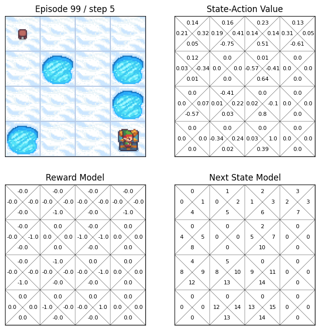

# Reinforcement-Learning-on-FrozenLake
**Reinforcement Learning on FrozenLake** is a collection of jupyter files that you can learn and try basic reinforcement learning algorithms.  

This repo is written for people who want to quickly learn basic concepts of Reinforcement Learning with code.  

## 💡 Features
- **Easy explanation of RL concepts**
  - This book contains key part of the book **"Reinforcement Learning: An Introduction"**([pdf](https://www.andrew.cmu.edu/course/10-703/textbook/BartoSutton.pdf)) by Richard S. Sutton and Andrew G. Barto.
  - The lecture **"Introduction to Reinforcement Learning with David Silver"**([link](https://www.deepmind.com/learning-resources/introduction-to-reinforcement-learning-with-david-silver)) is also referred. 
- **Interactive RL algorithm**
  - You can also run RL algorithms in FrozenLake-v1, a OpenAI Gymnasium environment, with hyperparmeter customization.
  - Wrapper for the environment can render not only the environment, but also state-action value or model of the algorithms.
  

    
  

## ☝️ Requirements
- Python >= 3.6
- Gymnasium >= 0.26.1
- Tensorflow >= 2.8 (for Chapter 7)
- Numpy
- Matplotlib
- IPython

## 📖 Contents
**Chapter1: Introduction to Reinforcement Learning**  
**Chapter2: Markov Decision Processes**  
**Chapter3: Dynamic Programming**   
**Chapter4: Model-Free Prediction**  
**Chapter5: Model-Free Control**  
**Chapter6: Eligibility Traces**  
**Chapter7: Policy Gradient Methods**  
**Chapter8: Integrating Learning and Planning**  
